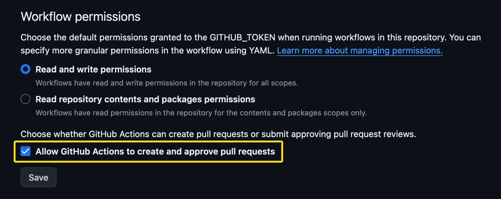

<h1 align="center" style="border-bottom: none;">🫡 @akashrajpurohit/ts-npm-template</h1>
<h3 align="center">A project template to bootstrap NPM package with Typescript</h3>
<br />
<p align="center">
  <a href="https://github.com/AkashRajpurohit/ts-npm-template/actions/workflows/release.yml">
    
  </a>
  <a href="https://www.npmjs.com/package/@akashrajpurohit/ts-npm-template">
    
  </a>
  <a href="https://www.npmjs.com/package/@akashrajpurohit/ts-npm-template">
    
  </a>
  
  <a href="https://github.com/AkashRajpurohit/ts-npm-template/actions">
    
  </a>
  <a href="https://www.npmjs.com/package/@akashrajpurohit/ts-npm-template">
    
  </a>
  <a href="https://twitter.com/akashwhocodes">
    
  </a>

  <p align="center">
    <a href="https://github.com/AkashRajpurohit/ts-npm-template/issues/new?template=bug_report.yml">Bug report</a>
    ·
    <a href="https://github.com/AkashRajpurohit/ts-npm-template/issues/new?template=feature_request.yml">Feature request</a>
    ·
    <a href="https://akashrajpurohit.github.io/ts-npm-template">Read Docs</a>
  </p>
</p>
<br />
<hr />

`@akashrajpurohit/ts-npm-template` is a opinionated bootstrap template to create NPM packages.

Read more about the template and how it works in [this guide](https://akashrajpurohit.com/blog/building-and-publishing-typescript-npm-packages-a-stepbystep-guide/?ref=ts-npm-template-readme).

## Usage 💻

Click on the **"Use this template"** button from the options to create a new repository using this template. This will create a new repository with the same structure as this repository.

That is pretty much it, follow the [configuration steps](#configurations-⚙️) for setting up your package and its done 🎉

## Technology stack 🚀

- 🙏🏾 [Typescript](https://www.typescriptlang.org/) with [tsup](https://tsup.egoist.dev/) build tool.
- ⚡️ [Vitest](https://vitest.dev/) - Unit Test Framework
- 📦 [Changesets](https://github.com/changesets/changesets) - A way to manage your versioning and changelogs.
- 📖 [Typedoc](https://typedoc.org/) - Generate documentation of your package.
- 🔀 [Github Actions](https://github.com/features/actions) - CI pipelines
- 💪 [PNPM](https://pnpm.io/) - Package manager

## Configurations ⚙️

### Github Actions

In order for changesets to be able to create pull requests, you need to allow it to create and approve pull requests. You can find these settings under the repository settings in the "Actions" tab.



### Release to NPM

Few configurations are required for making the publishing and releasing to NPM automated.

First thing is to generate a NPM token. Automation tokens are recommended since they can be used for an automated workflow, even when your account is configured to use the [auth-and-writes level of 2FA](https://docs.npmjs.com/about-two-factor-authentication#authorization-and-writes).

Save this token as `NPM_TOKEN` in [github actions secrets](https://docs.github.com/en/actions/security-guides/using-secrets-in-github-actions).

### Code coverage badge

If you want to generate a code coverage badge for your package, you need to follow the steps and configure the gist mentioned by [dynamic-badges-action](https://github.com/Schneegans/dynamic-badges-action).

You need to add the `GIST_SECRET` in the [github actions secrets](https://docs.github.com/en/actions/security-guides/using-secrets-in-github-actions) if you are planning to add the code coverage badge.

Once you have followed the steps above and created a gist, uncomment these lines in the [workflow file](./.github/workflows/ci.yml)

```
- name: Get Coverage for badge 🔢
  run: |
    COVERAGE="$(cat coverage/coverage-summary.json | jq -r '.total.lines.pct')"
    echo "COVERAGE=$(echo ${COVERAGE})" >> $GITHUB_ENV

- name: Create coverage badge ✍🏽
  uses: schneegans/dynamic-badges-action@v1.6.0
  with:
    auth: ${{ secrets.GIST_SECRET }}
    gistID: <gist-id>
    filename: <file-name>.json
    label: Code Coverage
    message: ${{ env.COVERAGE }}
    color: green
    namedLogo: vitest
```

> Note: Make sure you change the `<gist-id>` and `<file-name>` in the [ci.yml](./.github/workflows/ci.yml) file along with the gist id in the coverage badge link in the README.md file.

## Auto generate docs 📚

The project is configured to auto-generate the documentation using [typedoc](https://typedoc.org/). The documentation is generated in the `docs` folder.

The documentation will get generated when the code is pushed to the `main` branch. You can also generate the documentation locally by running the command `pnpm run build:docs`.

## Contributing 🫱🏻‍🫲🏼

Follow the [contribution guidelines](./CONTRIBUTING.md) to contribute to this project.

## Bugs or Requests 🐛

If you encounter any problems feel free to open an [issue](https://github.com/AkashRajpurohit/ts-npm-template/issues/new?template=bug_report.yml). If you feel the project is missing a feature, please raise a [ticket](https://github.com/AkashRajpurohit/ts-npm-template/issues/new?template=feature_request.yml) on GitHub and I'll look into it. Pull requests are also welcome.

## Projects using this template 🙌🏽

- [AkashRajpurohit/snowflake-id](https://github.com/AkashRajpurohit/snowflake-id) - Inspiration for this template.
- [AkashRajpurohit/utils](https://github.com/AkashRajpurohit/utils) - Common utility functions.
- [AkashRajpurohit/remark-add-query-param](https://github.com/AkashRajpurohit/remark-add-query-param) - Remark plugin to add query params to links.

> Are you using this template for your project? Feel free to open a PR and add your project to the list.

## Where to find me? 👀

[](https://akashrajpurohit.com/)
[](https://twitter.com/AkashWhoCodes)
[](https://linkedin.com/in/AkashRajpurohit)
[](https://instagram.com/akashwho.codes/)
[](https://t.me/AkashRajpurohit)
